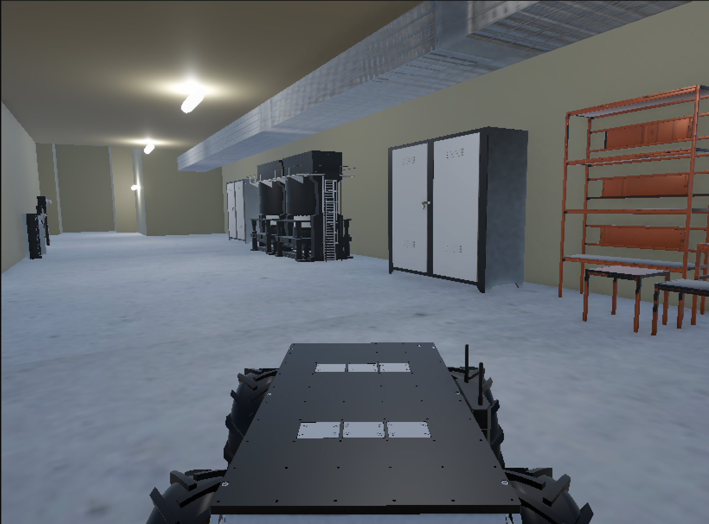
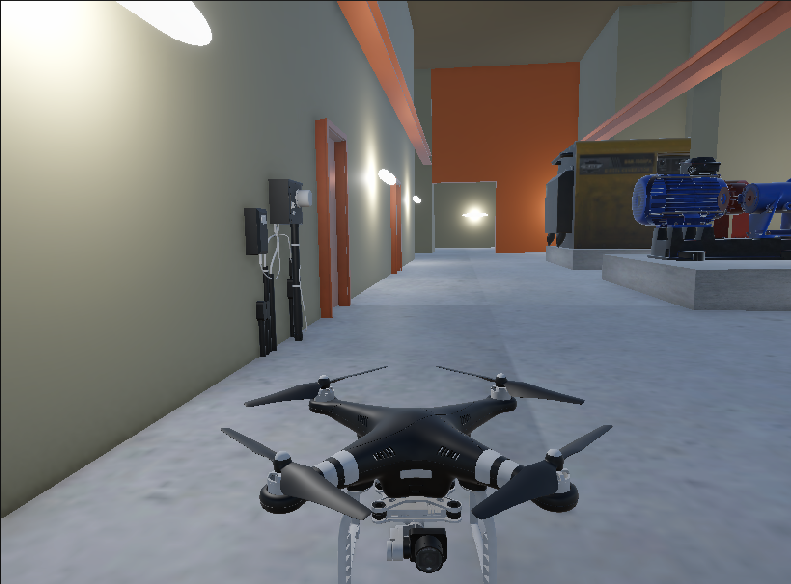

# NPP Digital Twin

**A photorealistic Unity simulation of the Zwentendorf Nuclear Power Plant (NPP)**, developed as a testing and validation platform for autonomous robotic systems operating in hazardous environments.

This digital twin was built from real-world data collected during the [EnRicH 2025](https://enrich.european-robotics.eu/) robotics hackathon and is part of the open-source release of the **RAICAM EU Project**. It supports hardware-in-the-loop testing of UAV and UGV platforms without requiring access to a physical nuclear facility.

> **Associated Paper:** *Low-Cost Rapid-Development Air-Ground Robotic Solution for Nuclear Power Plant Inspection* presented at SSRR 2025.

---

## Overview

The simulation was constructed by combining:
- An approximate floor plan of the Zwentendorf engine area and turbine hall (provided by competition organisers)
- 3D point cloud data collected by LiDAR sensors mounted on both the UGV and UAV during field trials
- Video footage recorded inside the facility, used to identify objects, materials, and spatial dimensions

The result is a Unity environment that replicates the multi-level halls, steel piping, control consoles, machinery, and narrow passageways of the Zwentendorf NPP. It was used to tune control gains, test fail-safes, and validate the full ROS2 software stack before real-world deployment.

---

## Figures from the Simulation

1. **Ground Robot (UGV)**
   
   *Point of view of the Ground Robot navigating the NPP interior*

2. **Aerial Robot (UAV)**
   
   *Point of view of the Aerial Robot during indoor flight*

3. **Operator GUI**
   
   *Four-screen operator GUI for simultaneous multi-operator UAV and UGV teleoperation and monitoring*

---


## How to Open the Simulation

1. **Download the Unity package**
   Download `prototype_v1.unitypackage` from the [Releases](../../releases) page.

2. **Create a new Unity 3D (URP) project**
   In Unity Hub, create a new project using the **3D (URP)** template. If you use the wrong template, shaders and lighting will not display correctly.

3. **Import the Unity package**
   With your project open, go to **Assets → Import Package → Custom Package...** and select `prototype_v1.unitypackage`. Import all assets when prompted.

4. **Open the main scene**
   In the Project window, navigate to the `Scenes/` folder and open the main NPP scene.

5. **Explore the simulation**
   Press **Play** to enter the simulation. You can switch between the UGV and UAV viewpoints and interact with the Zwentendorf NPP digital twin.

---

## Related Repositories

This simulation is part of a broader open-source release. The full system includes:

| Component | Repository |
|---|---|
| UAV Platform (Agipix V2) | https://sasakuruppuarachchi.github.io/agipix/ |
| UGV Platform | https://github.com/RAICAM-EU-Project/Enrich_UGV |
| PX4 Onboard Control | https://github.com/RAICAM-EU-Project/px4_onboard_control |
| Radiation Sensor Module | https://github.com/RAICAM-EU-Project/geiger_monitor |
| **NPP Digital Twin (this repo)** | https://github.com/kenanalperen/NPP-Digital-Twin |

---

## Context: EnRicH 2025

The Zwentendorf NPP is a decommissioned nuclear facility in Austria used as a testbed for robotic inspection research. At EnRicH 2025 (June 30 – July 4, 2025), teams were challenged to perform 3D environment mapping, radiation hotspot localisation, valve manipulation, and search-and-rescue tasks within a 30-minute window — without GNSS and with severely attenuated wireless signals due to thick concrete and steel structures.

This digital twin was essential for pre-competition validation: the full ROS2 stack and PX4 SITL model of the drone were tested inside the simulation before any real-world deployment, enabling rapid iteration in a resource-constrained three-week development cycle.

---

## Citation

If you use this simulation in your research, please cite:

```bibtex
@inproceedings{tian2025npp,
  title     = {Low-Cost Rapid-Development Air-Ground Robotic Solution for Nuclear Power Plant Inspection},
  author    = {Tian, Changda and Kuruppu Arachchige, Sasanka and Li, Haichuan and
               Garc{\'\i}a C{\'a}rdenas, Juan Jos{\'e} and Raei, Hamidreza and
               Dincer, Enes and Kenan, Alperen and Bremner, Paul and
               Giuliani, Manuel and Neumann, Gerhard and Ajoudani, Arash and
               Tapus, Adriana and Westerlund, Tomi and K{\"a}m{\"a}r{\"a}inen, Joni-Kristian and
               Figueredo, Luis and Watson, Simon and Trahanias, Panos},
  booktitle = {IEEE International Symposium on Safety, Security, and Rescue Robotics (SSRR)},
  year      = {2025}
}
```

---

## Acknowledgements

This work was funded by the European Commission's HORIZON.1.2 Marie Skłodowska-Curie Actions (MSCA) under Grant Agreement No. **101072634**, project [RAICAM](https://raicam.eu/).
